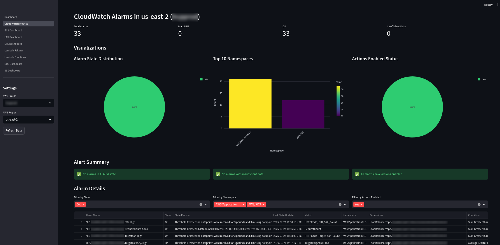
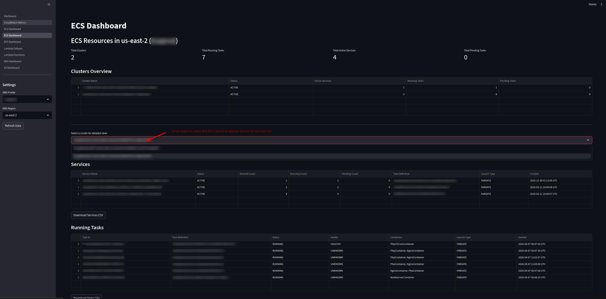
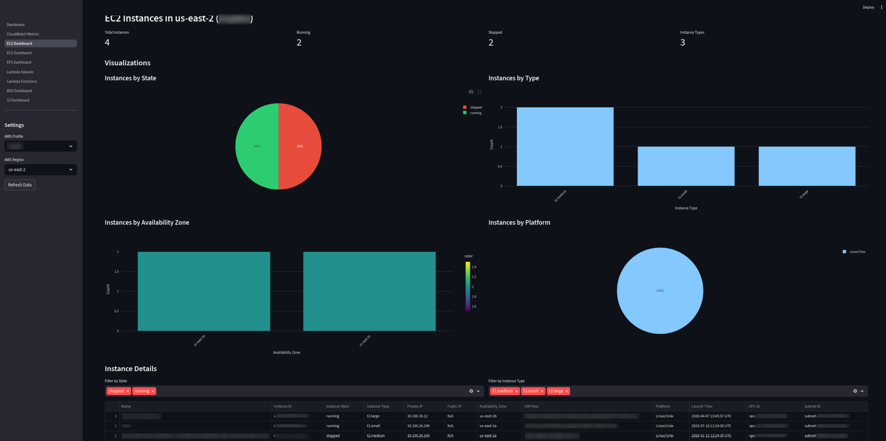
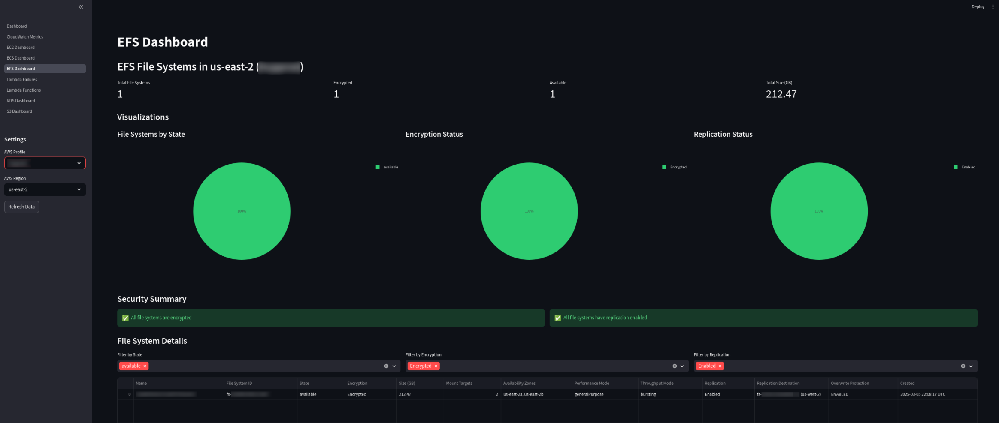
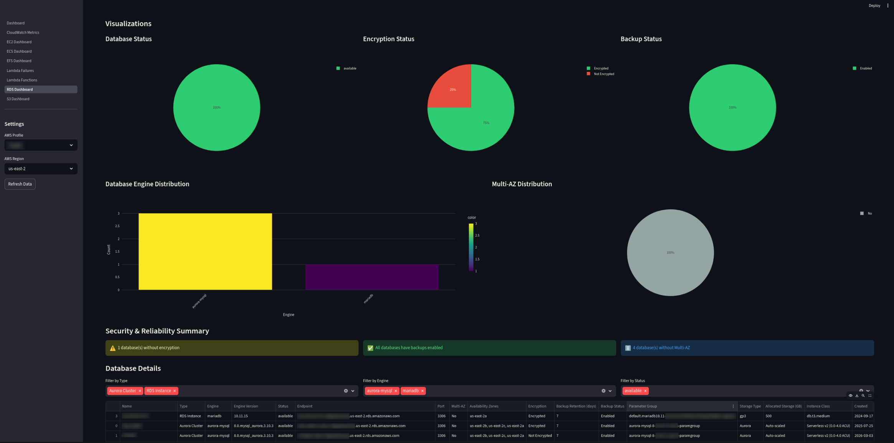
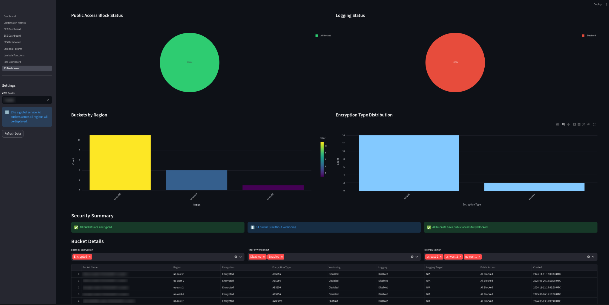
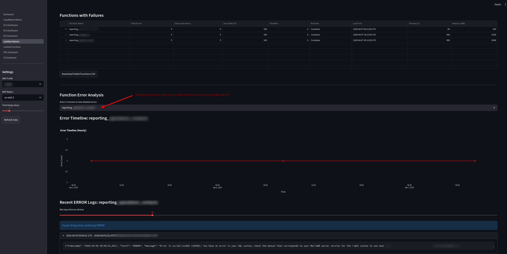

# AWS Cloud Dashboard - Dashboards Overview

This document provides an overview of all available dashboards in the AWS Cloud Health Dashboard application.

## Table of Contents

- [CloudWatch Metrics](#cloudwatch-metrics)
- [ECS Dashboard](#ecs-dashboard)
- [EC2 Dashboard](#ec2-dashboard)
- [EFS Dashboard](#efs-dashboard)
- [RDS Dashboard](#rds-dashboard)
- [S3 Dashboard](#s3-dashboard)
- [Lambda Failures](#lambda-failures)
- [Lambda Functions](#lambda-functions)

---

## CloudWatch Metrics

Monitor and manage your CloudWatch alarms with comprehensive visibility into your monitoring infrastructure.

**Features:**
- View all CloudWatch metric alarms and composite alarms
- Summary metrics (total alarms, ALARM state, OK state, insufficient data)
- Alarm details including state, conditions, thresholds, and actions
- Last state update timestamps in local time
- Interactive visualizations:
  - Alarm state distribution pie chart
  - Top namespaces by alarm count
  - Actions enabled status
- Alert summary highlighting alarms in ALARM state or with issues
- Filter by state, namespace, and actions enabled status
- CSV export functionality
- AWS profile selector to switch between different AWS accounts

---

## ECS Dashboard

Monitor your Amazon ECS clusters, services, and tasks for containerized applications.

**Features:**
- Cluster overview with status and capacity metrics
- Service health and deployment status
- Task monitoring and health status
- Container image tracking from task definitions
- Export data for offline analysis

---

## EC2 Dashboard

Monitor and analyze your Amazon EC2 instances across your infrastructure.

**Features:**
- View all instances with key information (Name, ID, State, Type, IPs)
- Track IAM roles and security configurations
- Visualize distribution by state, type, and availability zone
- Filter and export instance data for analysis
- Monitor resource allocation across your infrastructure

---

## EFS Dashboard

Monitor and manage your Amazon EFS file systems with detailed configuration insights.

**Features:**
- View all EFS file systems with configuration details
- Track encryption status and file system state
- Monitor total storage size and mount targets
- Analyze performance and throughput modes
- View replication configurations and overwrite protection
- Visualize distribution by state and performance characteristics
- Security summary for encryption and replication
- Filter and export file system data

---

## RDS Dashboard

Monitor and manage your Amazon RDS databases and Aurora clusters.

**Features:**
- View all RDS instances and Aurora clusters with configuration details
- Track encryption status and backup configurations
- Monitor Multi-AZ deployments for high availability
- Analyze database engines and versions
- View endpoints, ports, and connection details
- Track parameter groups and option groups
- Security summary for encryption, backups, and Multi-AZ
- Filter and export database data for compliance and analysis

---

## S3 Dashboard

Monitor and secure your Amazon S3 buckets with comprehensive security insights.

**Features:**
- View all S3 buckets with security and configuration details
- Track encryption status and encryption types
- Monitor versioning and logging configurations
- Analyze public access block settings
- Visualize bucket distribution by region
- Security summary highlighting potential issues
- Filter and export bucket data for compliance audits

---

## Lambda Failures

Track and troubleshoot Lambda function failures to quickly identify and resolve issues.

**Features:**
- Identify functions with errors over customizable time periods
- View error rates, throttles, and failure patterns
- Analyze error timelines with hourly granularity
- Search CloudWatch Logs for ERROR messages
- Export failure data and error logs for analysis

---

## Lambda Functions

Monitor and analyze your AWS Lambda functions across regions.

**Features:**
- View all Lambda functions with key metrics
- Track invocation history and status
- Analyze runtime distribution and memory usage
- Export data for further analysis

---

## Getting Started

1. Select a dashboard from the sidebar navigation
2. Choose your AWS profile from the dropdown (auto-detected from `~/.aws/` files)
3. Choose your AWS region
4. View real-time data from your AWS account

## Common Features

All dashboards include:
- **Real-time monitoring** - Live data from AWS APIs
- **Multi-region support** - Switch between regions easily
- **Multi-profile support** - Switch between AWS accounts/profiles on the fly
- **Data export** - Download data as CSV for offline analysis
- **CloudWatch integration** - Invocation metrics and performance data where applicable

## Configuration

This dashboard uses your AWS credentials configured via:
- AWS CLI profile (set via `AWS_PROFILE` environment variable)
- Mounted `~/.aws` directory for SSO authentication

---

*Last updated: April 2026*
