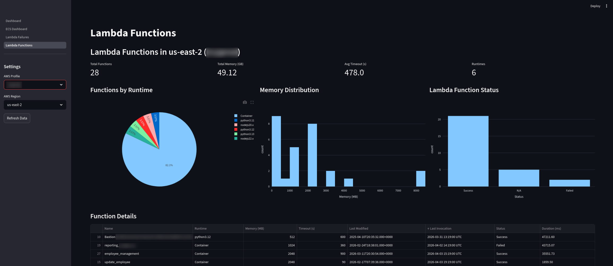

# Cloud Health Dashboard

A Streamlit-based web application for monitoring AWS resources.  The biggest benefit of this tool is that by logging in with "aws sso login" you can connect to any of your AWS accounts in an organization in real-time to check status, configuration, etc.

  

## Quick Start

### Prerequisites
- Docker and Docker Compose installed
- AWS credentials configured

### Option 1: Using Docker Compose (Recommended)

1. **Configure AWS credentials:**
   ```bash
   # Make sure you have AWS CLI configured
   aws configure
   
   # Optional: Set AWS profile if not using 'default'
   export AWS_PROFILE=your-profile-name
   ```

2. **Build and run the container:**
   ```bash
   docker compose up --build
   ```

3. **Access the dashboard:**
   Open your browser to [http://localhost:8501](http://localhost:8501)

4. **Stop the container:**
   ```bash
   docker compose down
   ```

### Option 2: Using Docker directly (Development)

```bash
# Build the dev image with your UID/GID
docker build \
  --target dev \
  --build-arg USER_UID=$(id -u) \
  --build-arg USER_GID=$(id -g) \
  -t cloud-dashboard:dev .

# Run with AWS credentials mounted
docker run -p 8501:8501 \
  -v ~/.aws:/home/appuser/.aws \
  -e AWS_CONFIG_FILE=/home/appuser/.aws/config \
  -e AWS_SHARED_CREDENTIALS_FILE=/home/appuser/.aws/credentials \
  -e AWS_PROFILE=default \
  -e AWS_DEFAULT_REGION=us-east-1 \
  cloud-dashboard:dev
```

### Option 3: Build for AWS Deployment - in development

```bash
# Build the AWS/production image (uses UID/GID 1000)
docker build --target aws -t cloud-dashboard:aws .

# Run (typically on ECS/EKS with IAM roles)
docker run -p 8501:8501 cloud-dashboard:aws
```

## Features

### Lambda Functions Dashboard
- View all Lambda functions in selected region
- Summary metrics (total functions, memory, timeouts)
- Interactive charts (runtime distribution, memory usage)
- Invocation metrics (last invocation time, status, duration)
- Sortable data table with CloudWatch metrics
- CSV export functionality
- **AWS profile selector** - Switch between different AWS accounts

### Lambda Failures Dashboard
- Monitor Lambda functions with errors over configurable time period (1-14 days)
- Summary metrics (failed functions count, total errors, average error rate, throttles)
- Top 10 functions by error count with color-coded error rates
- Error rate distribution histogram
- Detailed function analysis with hourly error timeline graphs
- CloudWatch Logs integration - search for ERROR messages
- Expandable log viewer showing full error messages with timestamps
- CSV export for failed functions and error logs
- Health status indicator when no failures detected
- **AWS profile selector** - Switch between different AWS accounts

### ECS Dashboard
- Cluster monitoring with status and capacity metrics
- Service health and deployment status (desired vs running counts)
- Running task monitoring with health status
- Container image tracking from task definitions
- Task definition details with CPU/memory allocation
- CSV export for all data tables
- **AWS profile selector** - Switch between different AWS accounts

### Multi-Page Navigation
- Easy navigation between different AWS service dashboards
- Consistent interface across all pages
- Per-dashboard region and profile selection
- Auto-detection of AWS profiles from `~/.aws/` files

## Configuration

### Multi-Stage Build

The Dockerfile uses a multi-stage build with two targets:

- **`dev`** - Development stage that matches your host UID/GID (default for docker-compose). Includes AWS CLI v2 for testing and debugging.
- **`aws`** - Production stage with fixed UID/GID 1000 for AWS deployment (ECS/EKS/Fargate). Minimal image without AWS CLI.

### User ID/Group ID Mapping

**For local development** (using docker-compose):

The `dev` stage uses your host user's UID/GID to avoid permission issues with mounted volumes:

```bash
# Set your UID/GID for the container
export USER_UID=$(id -u)
export USER_GID=$(id -g)

# Build and run the dev stage
docker compose up --build
```

**For AWS deployment**:

The `aws` stage uses fixed UID/GID 1000:

```bash
docker build --target aws -t cloud-dashboard:aws .
```

### AWS Profile Configuration

The dashboard automatically detects all AWS profiles from your `~/.aws/credentials` and `~/.aws/config` files. You can switch between profiles using the dropdown selector in each dashboard's sidebar.

**Default Profile**: The dashboard will pre-select the profile specified by the `AWS_PROFILE` environment variable, or `default` if not set.

To set a default profile for the container:

```bash
# Set AWS profile
export AWS_PROFILE=your-profile-name

# Run with both UID/GID and AWS profile
export USER_UID=$(id -u)
export USER_GID=$(id -g)
docker compose up --build
```

## Development

### Hot Reload Mode

The docker-compose.yml is configured to mount `Dashboard.py` and the `pages/` directory for hot reloading. Any changes to these files will automatically refresh the Streamlit app.

```bash
# Start in development mode
docker compose up

# Edit Dashboard.py or any file in pages/ - changes will be reflected immediately
```

### Adding New Dashboards

To add a new dashboard page:

1. Create a new Python file in the `pages/` directory
2. Pages will be listed in alpha-numerical order (e.g., `ECS_Dashboard.py before S3_Dashboard.py`)
3. The text before the .suffix (.py) becomes the sidebar label (e.g., `S3_Dashboard.py` → "S3 Dashboard")
4. Structure your page like the existing examples:

```python
import streamlit as st

st.set_page_config(page_title="Your Dashboard", layout="wide")
st.title("Your Dashboard")

# Your dashboard code here
```

**Page naming convention:**
- Files in `pages/` are displayed alphabetically in the sidebar
- `ECS_Dashboard.py` → "ECS Dashboard"
- `Lambda_Functions.py` → "Lambda Functions"

Streamlit automatically creates navigation in the sidebar for all files in the `pages/` directory.

### Testing with AWS CLI

The **dev stage** includes AWS CLI v2 for debugging and testing. You can exec into the running container:

```bash
# Shell into the running container (dev build only)
docker exec -it cloud_dashboard /bin/bash

# Test AWS credentials
aws sts get-caller-identity

# List Lambda functions
aws lambda list-functions --region us-east-1

# Check S3 buckets
aws s3 ls
```

**Note:** The `aws` production stage does not include AWS CLI to keep the image size minimal.

### Required IAM Permissions

Your AWS user/role needs these permissions:
```json
{
  "Version": "2012-10-17",
  "Statement": [
    {
      "Effect": "Allow",
      "Action": [
        "lambda:ListFunctions",
        "cloudwatch:GetMetricStatistics",
        "logs:DescribeLogGroups",
        "logs:FilterLogEvents",
        "ecs:ListClusters",
        "ecs:DescribeClusters",
        "ecs:ListServices",
        "ecs:DescribeServices",
        "ecs:ListTasks",
        "ecs:DescribeTasks",
        "ecs:DescribeTaskDefinition",
        "ecr:DescribeImages"
      ],
      "Resource": "*"
    }
  ]
}
```

## Tech Stack

- **Streamlit** - Web framework
- **Boto3** - AWS SDK for Python
- **AWS CLI v2** - Command-line tool for AWS (included in dev build only)
- **Pandas** - Data manipulation
- **Plotly** - Interactive charts
- **Docker** - Multi-stage containerization

## Project Structure

```
cloud_dashboard/
├── Dockerfile              # Multi-stage container definition (dev/aws targets)
├── docker-compose.yml      # Docker Compose configuration (uses dev stage)
├── .dockerignore          # Docker ignore rules
├── requirements.txt       # Python dependencies
├── Dashboard.py           # Main landing page
├── shared_libs.py         # Shared library functions
├── pages/                 # Multi-page app structure (alphabetically ordered)
│   ├── ECS_Dashboard.py       # ECS clusters, services, tasks monitoring
│   ├── Lambda_Failures.py     # Lambda failure analysis and error logs
│   └── Lambda_Functions.py    # Lambda functions overview and metrics
└── README.md             # This file
```

## Security Notes

- AWS credentials are mounted from `~/.aws` (writable for SSO cache)
- SSO profiles require write access to cache token files in `~/.aws/sso/cache/`
- No credentials are stored in the container image itself
- For production deployment in AWS, use IAM roles for EC2/ECS/EKS instead of credential files
- The container will automatically use the IAM role when deployed to AWS services

## Roadmap

- [x] Multi-page dashboard navigation
- [x] ECS dashboard implementation
  - [x] Cluster overview
  - [x] Service monitoring
  - [x] Task monitoring with runtime info
  - [x] Container image tracking
- [ ] EC2 instance monitoring
- [ ] S3 bucket analysis
- [ ] RDS database status
- [ ] Additional CloudWatch metrics and graphs
- [ ] Cost tracking and alerts
- [ ] Custom dashboard layouts

